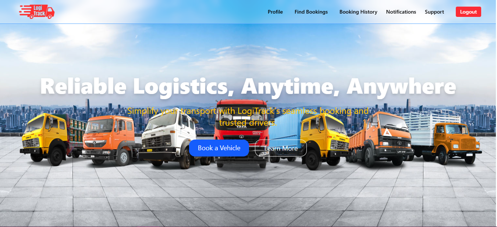
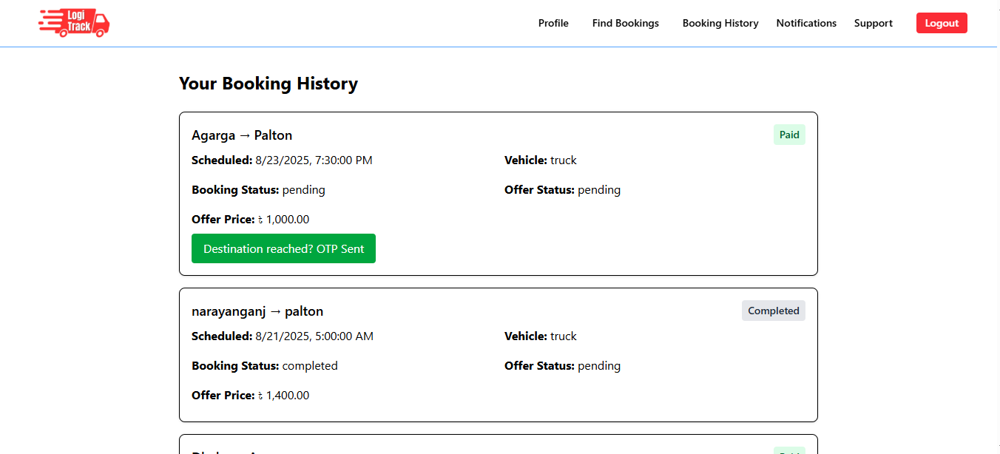
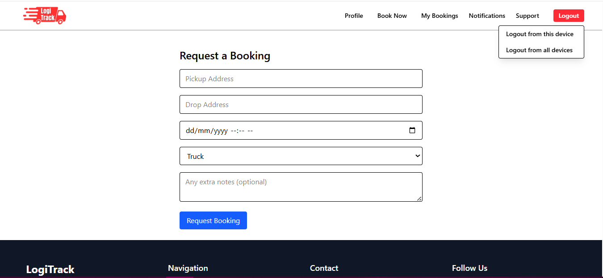
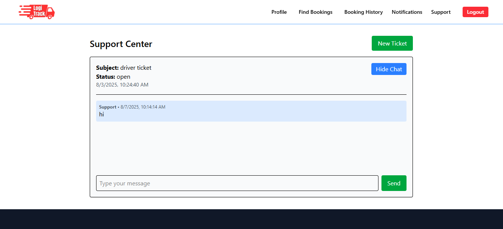

LogiTrack

LogiTrack is a professional fleet and vehicle booking system designed for logistics. It enables customers to book trucks or pickups, drivers to manage their fleet and offers, and admins to efficiently oversee operations. Built with React on the frontend and PHP on the backend, it demonstrates full-stack workflows, real-time notifications, and multi-role user management.

---

Features

Multi-role authentication (customer, driver, admin)

Vehicle registration and fleet management

Booking system with dynamic driver offers

Email notifications for bookings and updates

Support ticketing system for users and admins

Vehicle document management (licenses, insurance, etc.)

Admin dashboard for users, vehicles, and bookings

---

Tech Stack

Frontend: React.js, Tailwind CSS, React Router

Backend: PHP (custom API)

Database: MySQL / MariaDB

API Communication: Axios with session-based authentication

---

Demo Credentials

Role	Username	Password

Admin:	noman	123456
Driver:	driver	123456
User:	mhrsifat	123456

---

Screenshots

---

Getting Started

1. Clone the repository:

git clone https://github.com/yourusername/logitrack.git

2. Install frontend dependencies:

cd frontend
npm install
npm start

3. Set up backend:

Import the database schema in MySQL/MariaDB

Configure config.php or .env with database credentials

Start the PHP server or deploy via Apache/Nginx

4. Access the app at http://localhost:3000.

---

Notes

LogiTrack is primarily a learning project for React and full-stack PHP development.

Some features may be simplified and are not fully production-ready.
